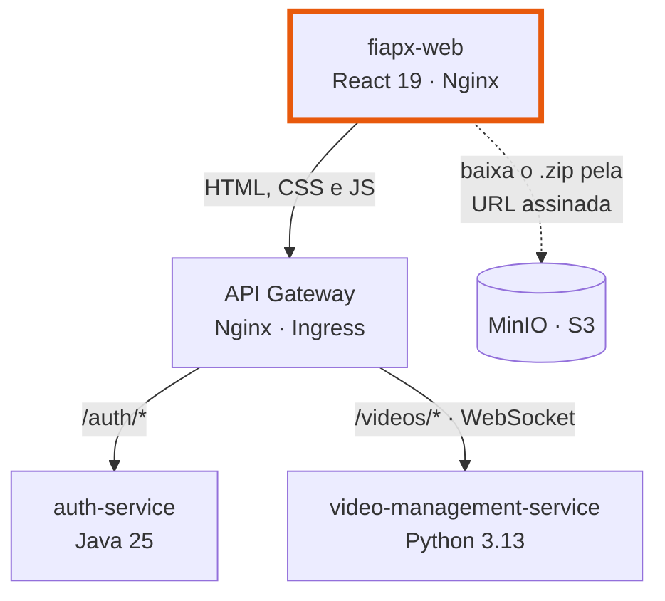
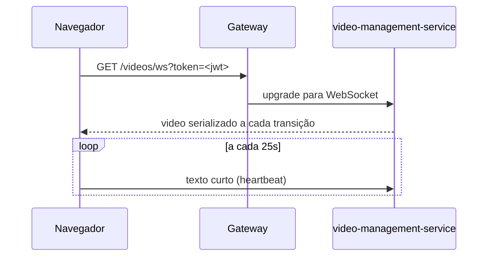

# fiapx-web

Interface do **FIAP X**: cadastro, login, envio do vídeo, acompanhamento do processamento em
tempo real e download do `.zip` com os quadros extraídos.

**React 19** · TypeScript 6 · Vite 8 · Nginx

## Repositórios do projeto

| Repositório | Linguagem | Papel |
| :--- | :--- | :--- |
| [fiapx-platform](https://github.com/rodolfomedeiros/fiapx-platform) | — | Compose, Kubernetes, contratos, topologia do broker |
| [fiapx-auth-service](https://github.com/rodolfomedeiros/fiapx-auth-service) | Java 25 · Spring Boot 4 | Cadastro, login, emissão e introspecção de JWT |
| [fiapx-video-management-service](https://github.com/rodolfomedeiros/fiapx-video-management-service) | Python 3.13 · FastAPI | Upload, listagem, download e WebSocket de tempo real |
| [fiapx-video-processor-worker](https://github.com/rodolfomedeiros/fiapx-video-processor-worker) | Rust 1.94 · Tokio | Extração de quadros com FFmpeg e compactação em `.zip` |
| [fiapx-notification-service](https://github.com/rodolfomedeiros/fiapx-notification-service) | Go 1.25 | Consumo da DLQ e envio de e-mail de falha |
| **fiapx-web** *(você está aqui)* | React 19 · TypeScript 6 | Interface de upload, acompanhamento e download |

> Para subir o sistema inteiro, use o **fiapx-platform**. Este repositório sozinho precisa
> apenas do gateway acessível em `http://localhost:8080`.

## Onde esta aplicação entra



O container desta aplicação **só entrega arquivos estáticos**. Quem roteia `/auth` e
`/videos` é o gateway na frente, e é por isso que não há configuração de endereço de API
aqui: as chamadas saem para a mesma origem de onde a página veio. Isso elimina CORS,
elimina uma variável de ambiente que precisaria ser injetada em tempo de build e faz o
WebSocket funcionar sem tratamento especial.

O `.zip` nunca passa por este servidor: `GET /videos/{id}/download` devolve uma URL assinada
do object storage e o navegador busca o arquivo direto de lá.

## O que a tela faz

| Área | Comportamento |
| :--- | :--- |
| **Entrar / Criar conta** | `POST /auth/register` seguido de `POST /auth/login`, porque o cadastro não emite token |
| **Envio** | Arrastar ou escolher o arquivo, com barra de progresso e cancelamento |
| **Lista** | `GET /videos` paginado, com filtro por status |
| **Tempo real** | Cada transição chega pelo WebSocket — a tela **não faz polling** |
| **Download** | Botão que aparece só em `COMPLETED` e leva à URL assinada |

Extensão e tamanho são conferidos **antes** do envio, com as mesmas regras do serviço
(`.mp4 .avi .mov .mkv .wmv .flv .webm`, até 500 MB): não faz sentido subir 600 MB para
receber um `413` no fim.

O envio usa `XMLHttpRequest` em vez de `fetch` por um motivo só: é a única API que informa
o progresso do corpo enviado, e é isso que dá sinal de vida a um arquivo grande.

## Tempo real



Duas decisões merecem nota:

1. **O token vai na query string.** A API de WebSocket do navegador não permite enviar
   headers, e o serviço aceita as duas formas justamente por isso.
2. **O cliente manda um heartbeat.** O Nginx encerra conexões ociosas, e um socket em que
   ninguém fala fica ocioso o tempo todo. O serviço lê e descarta o que o cliente envia —
   é para isso que existe o laço de `receive_text` do lado de lá.

Se a conexão cair, ela é refeita com espera crescente de 1s até 15s — mas nem toda queda
merece nova tentativa, e o código de fechamento **não** basta para decidir. O serviço
recusa um token inválido antes de aceitar o handshake, e um handshake recusado chega ao
navegador como `1006` (HTTP 403 na prática), sem código de aplicação; o `1008` que o
servidor pede só apareceria se a recusa viesse com o socket já aberto. Como `1006` significa
tanto “token morto” quanto “servidor fora do ar”, quem desempata é uma requisição
autenticada barata: um `401` encerra a sessão, qualquer outra resposta agenda a próxima
tentativa. Sem isso, um token expirado deixaria a interface reconectando em laço.

Ao receber uma atualização, a lista troca o item no lugar quando não há filtro ativo — a
ordem é por data de criação e não muda com o status. Com filtro, o vídeo pode precisar
entrar ou sair da página, e só o servidor sabe qual é a página correta: a lista é recarregada.

## Sessão

O JWT fica no `localStorage`. As claims são lidas **sem verificar a assinatura**, e isso é
intencional: servem só para exibir o nome de quem entrou e para descartar um token vencido
antes de gastar uma requisição. Quem valida o token de verdade é o auth-service, pela
introspecção que o serviço de vídeos faz a cada chamada — nada no navegador decide acesso.

Qualquer `401` encerra a sessão e devolve à tela de login com o aviso de expiração.

## Organização

| Arquivo | Responsabilidade |
| :--- | :--- |
| `src/api.ts` | Chamadas ao gateway, mensagens de erro e abertura do WebSocket |
| `src/session.ts` | Leitura das claims, persistência e expiração |
| `src/useVideos.ts` | Lista, paginação e a conexão de tempo real |
| `src/types.ts` | Formatos devolvidos pelos serviços |
| `src/App.tsx` | Composição da tela, filtros e paginação |
| `src/components/` | `AuthPanel`, `UploadPanel`, `VideoTable`, `StatusBadge` |
| `nginx.conf` | Entrega estática, fallback do SPA e `/health` |

## Executar

```sh
npm install
npm run dev
```

Sobe em http://localhost:5173. O proxy do Vite encaminha `/auth` e `/videos` para
`http://localhost:8080`, o gateway do Compose — inclusive o upgrade do WebSocket. Para
apontar para outro endereço:

```sh
GATEWAY_URL=http://staging.exemplo:8080 npm run dev
```

Com a infraestrutura do Compose de pé, o padrão funciona sem configuração adicional.

## Build e container

```sh
npm run build     # tsc -b && vite build
npm run lint      # oxlint
docker build .
```

O `Dockerfile` é multi-stage: Node compila e a imagem final é um Nginx com o `dist`. Os
arquivos em `assets/` levam o hash do conteúdo no nome e são cacheados por um ano; o
`index.html` é servido com `no-cache`, senão um deploy novo continuaria apontando para os
assets antigos.

## CI

[.github/workflows/ci.yml](.github/workflows/ci.yml) roda `oxlint`, `npm run build` — que
inclui a checagem de tipos — e `docker build` a cada push.
